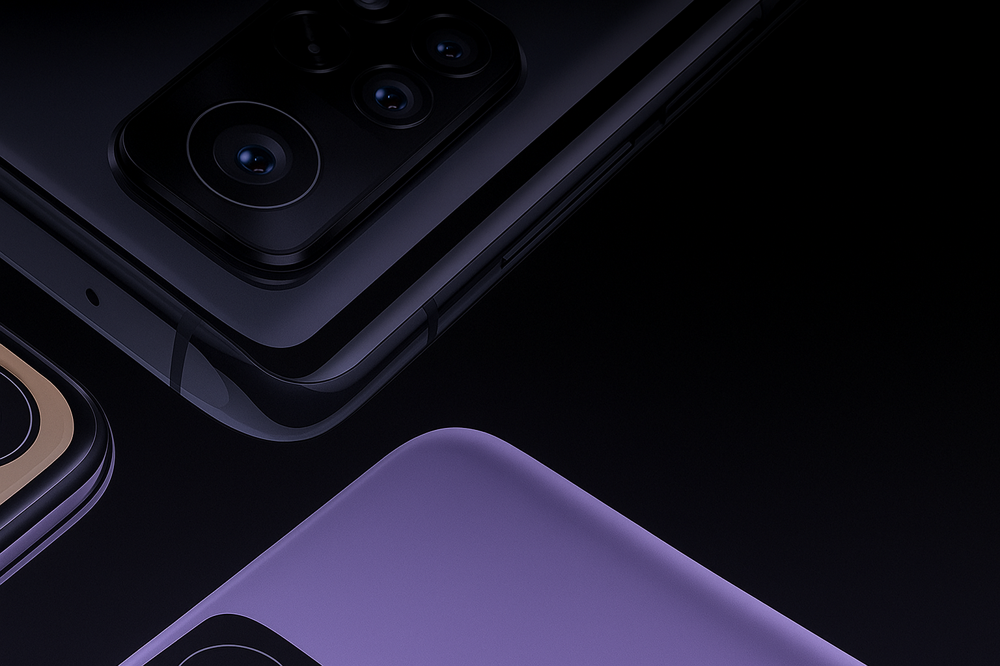

  

---

<h2 align="center">
  <a href="https://github.com/Mi-Apollo/custom_rom_releases/releases"> Download & Changelogs </a>
</h2>

---

  </a>
  
  
  

---

## 📱 Supported ROMs

| **OFFICIAL** | **UNOFFICIAL** |
|---------------|----------------|
| [AxionOS](https://github.com/AxionAOSP-devices/android_device_xiaomi_apollo/releases/tag/v2.1) | AlphaDroid |
| [RisingOSS Revived](https://github.com/Mi-Apollo/custom_rom_releases/releases/tag/rising-8.1.1) | Black Iron Project |
|  | Cherish OS |
|  | [CrDroid](https://github.com/Mi-Apollo/custom_rom_releases/releases/tag/crdroid-12.2) |
|  | [Derpfest](https://pixeldrain.com/u/UHpgiCHV) |
|  | [EvolutionX](https://github.com/Mi-Apollo/custom_rom_releases/releases/tag/evox-11.3) |
|  | [InfinityX](https://github.com/Mi-Apollo/custom_rom_releases/releases/tag/inf-3.3) |
|  | LMODroid |
|  | [Lunaris OS](https://github.com/Mi-Apollo/custom_rom_releases/releases/tag/luna-3.5) |
|  | [Project Matrixx](https://github.com/Mi-Apollo/custom_rom_releases/releases/tag/mtrx-11.9) |
|  | [Mist OS](https://github.com/Mi-Apollo/custom_rom_releases/releases/tag/mist-4.2) |
|  | Pixel OS |
|  | Project PixelAge |
|  | [Voltage OS](https://github.com/Mi-Apollo/custom_rom_releases/releases/tag/vos-5.2) |
|  | YAAP |

---

## ⚙️ Features
- Dolby 
- ViPER
- Per-App Refresh Rate
- Many more...

---

## 🙏 Credits
- First of All Allah Almighty
- Every ROM and their maintainers
- My Patreons 💖

---

## 🤝 Contributing

We welcome contributions to keep **Apollo** alive!

### 💙 Support & Donations
Maintaining this project takes time and effort. If you’d like to support development:

- **Patreon:** [@MurtazaKolachi](https://www.patreon.com/c/MurtazaKolachi)  
- **USDT (TRX):** `TTUwUJzyvkP31Yvm8XVGKZSIGFcjbFcsG2`  
- **USDT (BSC):** `0xbc624341debc4fcb22a52a8f70cc34b0c97de516`
